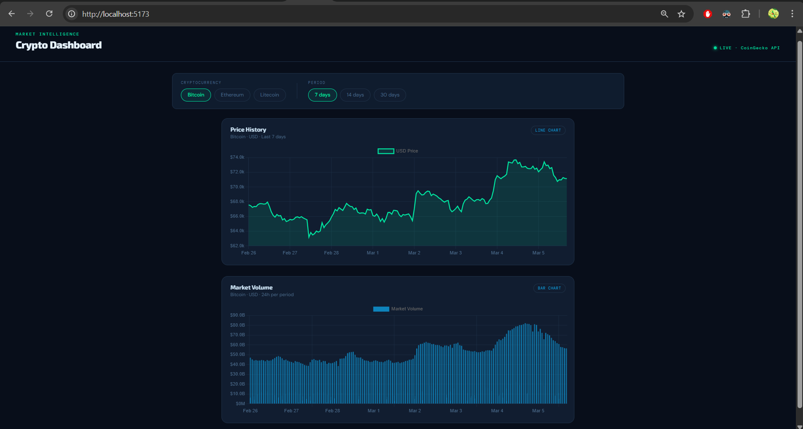
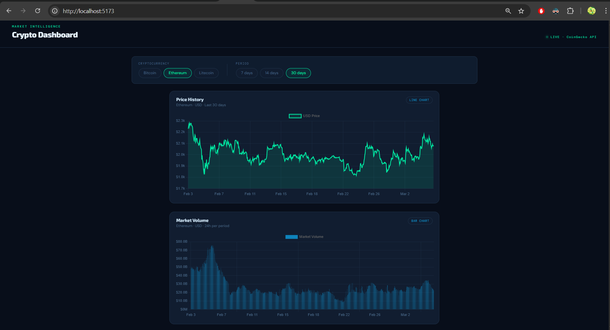
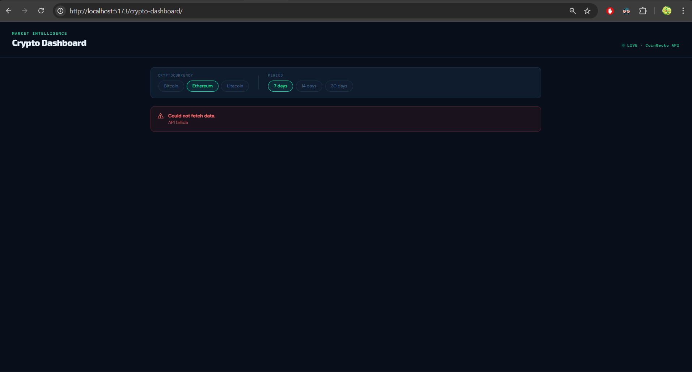
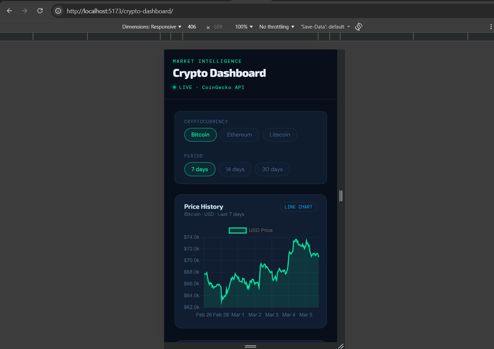

# Crypto Dashboard

Dashboard interactivo de criptomonedas construido con React, TypeScript y Chart.js, con datos en tiempo real de la API pública de CoinGecko.

## Demo en vivo

🔗 [Ver demo](#)

## Capturas de pantalla

### Estado inicial


### Filtros aplicados


### Estado de error


### Vista móvil


---

## Funcionalidades

- **Datos en tiempo real** desde CoinGecko API — sin API key requerida
- **Dos tipos de gráfico** — línea para historial de precio, barras para volumen de mercado
- **Filtros dinámicos** — Bitcoin, Ethereum y Litecoin, con períodos de 7, 14 y 30 días
- **Gráficos se actualizan al instante** al cambiar los filtros
- **Tooltips al hacer hover** con valores formateados en USD
- **Skeleton de carga** mientras se obtienen los datos
- **Mensaje de error amigable** si la petición a la API falla
- **Navegación por teclado** — todos los elementos interactivos son accesibles con Tab y Enter
- **Compatible con lectores de pantalla** — atributos ARIA en toda la interfaz
- **Diseño responsivo** — adaptado para escritorio, tablet y móvil

---

## Tecnologías utilizadas

| Herramienta | Uso |
|---|---|
| React 18 | Framework de UI |
| TypeScript | Tipado estático |
| Chart.js + react-chartjs-2 | Visualización de datos |
| Axios | Peticiones HTTP |
| CSS Grid + Flexbox | Layout responsivo |
| Jest + Testing Library | Pruebas unitarias |
| Vite | Herramienta de build |

---

## Estructura del proyecto
```
crypto-dashboard/
├── public/
│   └── screenshots/
│       ├── inicial.png
│       ├── filtros.png
│       ├── error.png
│       └── movil.png
├── src/
│   ├── api/
│   │   └── coingeckoService.ts       # Llamadas a la API y transformación de datos
│   ├── components/
│   │   ├── __tests__/
│   │   │   └── PriceChart.test.tsx   # Pruebas unitarias del componente
│   │   ├── PriceChart.tsx            # Gráfico de línea para historial de precio
│   │   └── VolumeChart.tsx           # Gráfico de barras para volumen de mercado
│   ├── hooks/
│   │   ├── __tests__/
│   │   │   └── useCryptoData.test.ts # Pruebas unitarias del hook
│   │   └── useCryptoData.ts          # Hook personalizado — fetching, carga y error
│   ├── styles/
│   │   └── dashboard.css             # Sistema de diseño, layout y animaciones
│   ├── types/
│   │   ├── crypto.types.ts           # Interfaces de TypeScript
│   │   └── jest-dom.d.ts             # Tipos globales para jest-dom
│   ├── utils/
│   │   └── chartConfig.ts            # Registro global de módulos de Chart.js
│   ├── App.tsx                       # Componente principal, estado de filtros y layout
│   ├── jest.setup.ts                 # Mock de canvas para entorno de tests
│   └── main.tsx                      # Punto de entrada de la app
├── .gitignore
├── eslint.config.js
├── index.html
├── jest.config.cjs
├── package.json
├── tsconfig.app.json
├── tsconfig.json
├── tsconfig.node.json
└── vite.config.ts
```

---

## Instalación y configuración

### Requisitos previos

- Node.js 18+
- npm o yarn

### Pasos
```bash
# 1. Clonar el repositorio
git clone https://github.com/tu-usuario/crypto-dashboard.git

# 2. Entrar a la carpeta del proyecto
cd crypto-dashboard

# 3. Instalar dependencias
npm install

# 4. Iniciar el servidor de desarrollo
npm run dev
```

La app estará disponible en `http://localhost:5173`

### Ejecutar pruebas
```bash
npm test
```

---

## Enfoque y decisiones técnicas

### Elección de la API
Se eligió CoinGecko por su acceso público gratuito sin API key, su confiabilidad y su estructura de datos limpia que se mapea directamente a los requerimientos de los gráficos.

### Decisiones de arquitectura
- **Hook personalizado (`useCryptoData`)** — separa la lógica de fetching de los componentes de UI, haciendo ambos independientemente testeables
- **Registro global de Chart.js (`chartConfig.ts`)** — los módulos se registran una sola vez al iniciar la app en lugar de por componente, siguiendo el principio de single source of truth
- **Pill buttons en lugar de `<select>`** — mejor UX, más fáciles de estilizar y más accesibles con el estado `aria-pressed`
- **UI en inglés, código en español** — el texto visible al usuario está en inglés por consistencia con el dominio (crypto es un dominio predominantemente en inglés), mientras que las variables y comentarios internos siguen convención en español

### Sistema de diseño
- Tema oscuro optimizado para interfaces con alta densidad de datos
- Dos colores de acento: verde (`#00e5a0`) para precio, azul cielo (`#0ea5e9`) para volumen
- Tipografía: Exo 2 para títulos, DM Mono para datos y etiquetas, DM Sans para texto de UI
- Variables CSS para cambio de tema desde un solo lugar

### Accesibilidad
- Todos los elementos interactivos (pill buttons) son navegables con teclado
- `aria-pressed` comunica el estado de selección a lectores de pantalla
- `role="status"` + `aria-live="polite"` en el estado de carga
- `role="alert"` en el estado de error para anuncio inmediato
- Los gráficos usan `role="img"` + `aria-label` descriptivo, ya que Chart.js renderiza en canvas, que no es navegable por teclado de forma nativa

---

## Problemas conocidos y supuestos

- **Se asume** conexión a internet estable para consumir la API de CoinGecko
- **Se asume** un navegador moderno (Chrome, Firefox, Safari, Edge) con soporte para CSS Grid y variables CSS
- **Rate limiting de CoinGecko** — el tier gratuito permite 10-30 llamadas por minuto. Cambiar filtros muy rápido puede generar errores temporales, manejados correctamente por el estado de error
- **Redes corporativas** — algunas redes con inspección SSL pueden bloquear la API con un error `ERR_CERT_AUTHORITY_INVALID`. Cambiar a otra red resuelve el problema
- **Accesibilidad del canvas** — Chart.js renderiza en canvas HTML, que no tiene navegación por teclado nativa. Una mejora futura sería agregar una tabla de datos visualmente oculta como representación alternativa
- Los datos se obtienen en cada cambio de filtro sin caché — una mejora futura sería memorizar las respuestas para reducir las llamadas a la API

---

## Autora

Karen — Candidata a Desarrollador Web @ Dinametra
